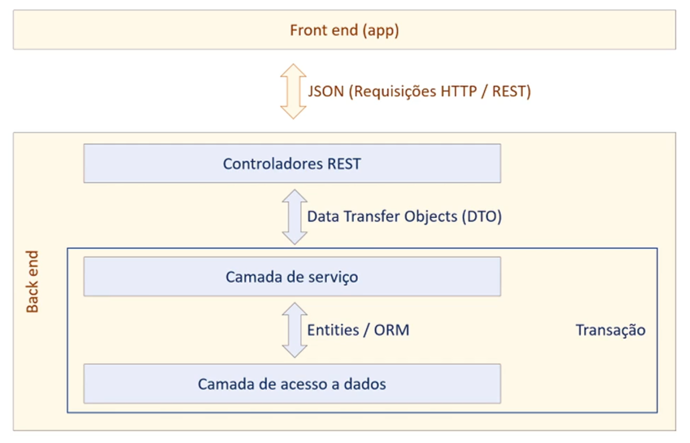
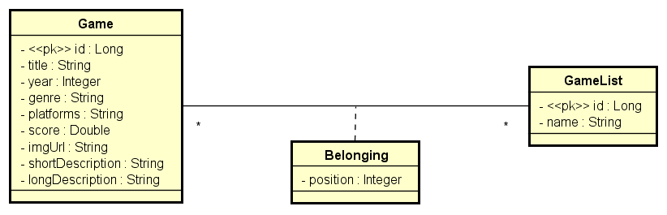

# DSlist

Este projeto é uma aplicação Spring Boot desenvolvida como parte de um curso, focada na criação de uma API REST para gerenciar listas de jogos. Ele demonstra conceitos importantes de desenvolvimento backend, incluindo arquitetura de camadas, manipulação de banco de dados com Spring Data JPA e Dockerização para deploy.

## Funcionalidades

- **API RESTful:** Implementação de endpoints para operações CRUD em listas de jogos.
- **Gerenciamento de Jogos:** Permite adicionar, remover, atualizar e listar jogos.
- **Relacionamentos N-N:** Demonstração de relacionamentos muitos-para-muitos entre entidades.
- **Projeções:** Utilização de projeções para otimizar consultas de banco de dados.
- **Dockerização:** Configuração para deploy fácil usando Docker.

## Tecnologias Utilizadas

- Java
- Spring Boot
- Spring Data JPA
- H2 e PostgreSQL
- Docker

## Estrutura do Projeto

O projeto segue uma arquitetura de camadas bem definida, separando as responsabilidades:

- **Controller:** Lida com as requisições HTTP e retorna as respostas.
- **Service:** Contém a lógica de negócio da aplicação.
- **Repository:** Interage com o banco de dados, utilizando Spring Data JPA.
- **DTO (Data Transfer Object):** Utilizado para transferir dados entre as camadas de forma otimizada.



## Banco de Dados

O banco de dados é modelado para suportar listas de jogos e seus relacionamentos. As imagens `db-relationships.png` e `layer-structure.png` na pasta `images` do repositório ilustram o diagrama de relacionamento do banco de dados e a estrutura de camadas, respectivamente.




## Como Rodar o Projeto

### Pré-requisitos

- Java 21
- Maven
- Docker e Docker Compose (opcional, para ambiente local)

### Configuração do Ambiente Local

1.  **Clone o repositório:**

    ```bash
    git clone https://github.com/PMota173/DSlist.git
    cd DSlist
    ```

2.  **Configurar o Banco de Dados:**

    Você pode usar o Docker Compose para subir um container PostgreSQL:

    ```bash
    docker-compose up -d
    ```

    Ou configure manualmente um banco de dados PostgreSQL e atualize as configurações no `application.properties`.

3.  **Rodar a Aplicação:**

    A aplicação estará disponível em `http://localhost:8080`.

## Deploy

O projeto inclui um `Dockerfile` para facilitar o deploy em ambientes como o Render. Mais detalhes sobre o processo de deploy podem ser encontrados na documentação do Spring Boot e na plataforma de deploy escolhida.
